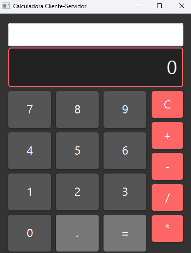
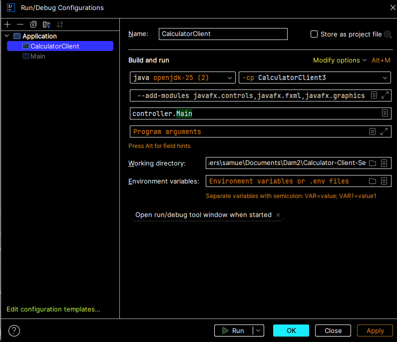
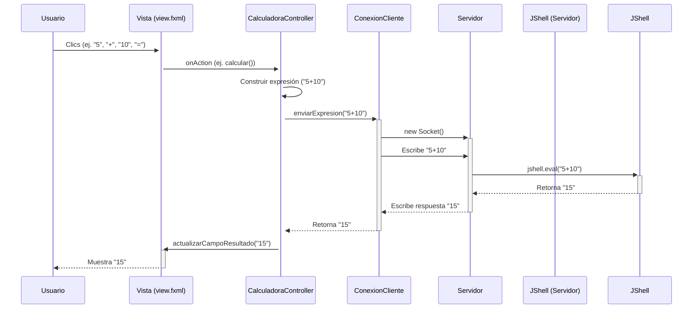

# ¿De donde he sacado la info para hacer este proyecto?

https://github.com/KateStar-git/Calculator-Client-Server

# Calculadora Cliente-Servidor en JavaFX

Proyecto académico que implementa una calculadora con interfaz gráfica (GUI) construida en **JavaFX**. La lógica de negocio (las operaciones matemáticas) está desacoplada de la interfaz y se gestiona en un **servidor Java remoto**, con el que se comunica a través de **Sockets TCP**.

Este proyecto demuestra los principios de la programación en red, la separación de la lógica y la vista (similar a un modelo **MVC**) y el manejo de la concurrencia básica en Java.

---

## Índice

- [Captura de Pantalla del funcionamiento](#1-interfaz-)
- [Requisitos Previos](#2-requisitos-previos)
- [Guía de Instalación y Configuración (JavaFX en IntelliJ)](#3-guía-de-instalación-y-configuración-javafx-en-intellij)
- [Estructura del Proyecto](#4-estructura-del-proyecto)
- [Arquitectura y Flujo de Comunicación](#5-arquitectura-y-flujo-de-comunicación)
- [Lecciones Aprendidas y Posibles Mejoras](#6-lecciones-aprendidas-y-posibles-mejoras)
- [Autor](#7-autor)

---

## 1. Interfaz 

* La calculadora de leed_malditos :) *

>  `)*

---

## 2. Requisitos Previos

Para compilar y ejecutar este proyecto, necesitarás:

- **JDK** (Java Development Kit): Versión **17 o superior**.
- **IntelliJ IDEA**: (Community o Ultimate Edition).
- **JavaFX SDK**: La biblioteca de JavaFX **no viene incluida** en el JDK estándar y debe descargarse por separado.

---

## 3. Guía de Instalación y Configuración (JavaFX en IntelliJ)

Esta es la parte más crítica de la configuración del proyecto, ya que JavaFX requiere una configuración manual en entornos como IntelliJ.

### 3.1. Descargar el SDK de JavaFX

1. Ve al [sitio web oficial de GluonHQ (JavaFX)](https://gluonhq.com/products/javafx/).
2. Descarga el **JavaFX SDK** correspondiente a tu sistema operativo y versión de JDK (por ejemplo, *JavaFX Windows x64 SDK*).
3. Descomprime el archivo `.zip` en una ubicación permanente en tu sistema, por ejemplo:  
   `C:\java\javafx-sdk-21`.

### 3.2. Configurar IntelliJ IDEA

#### 3.2.1. Crear la Librería de JavaFX

IntelliJ necesita saber dónde se encuentran los archivos `.jar` de JavaFX.

1. Abre el proyecto en IntelliJ.
2. Ve a **File > Project Structure...** (o `Ctrl+Alt+Shift+S`).
3. En el panel izquierdo, selecciona **Libraries**.
4. Haz clic en el icono **+ (Añadir)** y selecciona **Java**.
5. Navega hasta la carpeta donde descomprimiste el SDK y selecciona la subcarpeta `lib` (ej. `C:\java\javafx-sdk-21\lib`).
6. Haz clic en **OK**. IntelliJ detectará todos los archivos `.jar`.
7. Dale un nombre a la librería (ej. `JavaFX-21`) y aplícalo al módulo de tu cliente (`Cliente`).

#### 3.2.2. Añadir VM Options *(El paso más importante)*

El proyecto fallará al ejecutarse si la Máquina Virtual de Java (JVM) no sabe dónde encontrar los módulos de JavaFX.

1. En la barra superior, ve a **Run > Edit Configurations...**.
2. Selecciona la configuración de tu clase `Main` del cliente (dentro de `ClienteRepository`).
3. Busca el campo **"VM options"**.  
   *(Si no lo ves, haz clic en **Modify options > Add VM options**)*.
4. En este campo, pega la siguiente línea, asegurándote de **cambiar la ruta** a la de tu propia carpeta `lib`:

```bash
--module-path "C:\java\javafx-sdk-21\lib" --add-modules javafx.controls,javafx.fxml,javafx.graphics
```

- `--module-path` le dice a Java dónde buscar los módulos.
- `--add-modules` le dice a Java qué módulos específicos cargar.

 *Con esto, el cliente debería poder compilar y ejecutar correctamente.*

---

---

## 4. Estructura del Proyecto

El proyecto está dividido en **dos repositorios principales**, cada uno conteniendo un módulo de IntelliJ.

### 4.1. Módulo Cliente (`ClienteRepository`)

Responsable de toda la interfaz gráfica y la interacción con el usuario.

```text
ClienteRepository/
└── Cliente/
    └── src/
        ├── controller/
        │   ├── CalculadoraController.java  // (Controlador) Lógica de la UI, maneja clics de botones.
        │   ├── ConexionCliente.java        // (Modelo) Maneja la conexión y envío de datos al servidor.
        │   └── Main.java                   // (Principal) Inicia la app JavaFX y carga el FXML.
        │
        └── view/
            ├── styles.css                  // (Vista) Define los estilos (colores, fuentes, fondos).
            └── view.fxml                   // (Vista) Define la estructura de la interfaz (botones, cajas de texto).
```

### 4.2. Módulo Servidor (`ServidorRepository`)

Responsable de escuchar peticiones, procesar los cálculos y devolver un resultado.

```text
ServidorRepository/
└── Servidor/
    └── src/
        └── controller/
            ├── Main.java         // (Principal) Inicia el bucle principal del servidor.
            └── Servidor.java     // (Modelo) Escucha en un ServerSocket y usa JShell para evaluar.
```

---

## 5. Arquitectura y Flujo de Comunicación

El sistema utiliza **Sockets TCP** para la comunicación entre el cliente JavaFX y el servidor Java. El servidor es responsable de la lógica de negocio (la matemática).

### 5.1. Flujo de Datos

1. **Entrada del Usuario**: El usuario interactúa con la Vista (`view.fxml`).
2. **Captura y Construcción**: El `CalculadoraController` captura los clics y construye la expresión matemática (ej. `"5+10"`).
3. **Envío**: El `ConexionCliente` toma la expresión y la envía al servidor a través de un **Socket TCP**.
4. **Recepción y Proceso (Servidor)**: El `Servidor` acepta la conexión, lee la expresión y la evalúa de forma segura utilizando **JShell** (la herramienta de evaluación de expresiones de Java).
5. **Respuesta**: El `Servidor` envía el resultado (ej. `"15"`) de vuelta al cliente.
6. **Actualización**: El `CalculadoraController` recibe el resultado y lo muestra en el `campoResultado` de la interfaz.

### 5.2. Diagrama de Secuencia (Mermaid)

Este diagrama ilustra el flujo detallado de una operación completa:




> 💡 *Nota: Este funcionamiento es basico, sirve como guia de como nunciona nuestro prohgrama*

---

## 6. Lecciones Aprendidas y Posibles Mejoras

### 6.1. Errores Comunes y Lecciones

- **`javafx.fxml.LoadException: Missing resource key`**  
  **Causa**: Uso de caracteres especiales (`%`, `←`) en los atributos `text=""` del FXML, que el cargador interpreta erróneamente como claves de internacionalización.  
  **Lección**: Evitar caracteres especiales en FXML o usar sus entidades XML correspondientes, o simplemente usar texto plano (ej. `MOD` o `DEL`).
  **Recordatorio para mi yo del futuro**: Aprende a hacer cosas simple y escribir un string como es debido no te metas en codigos asci solo pierdes tiempo

- **Inconsistencia FXML/Controlador**  
  **Causa**: Discrepancia entre los nombres de los métodos `onAction` en el FXML y los métodos reales `@FXML` en la clase controladora Java.  
  **Lección**: Todos los `fx:id` y `onAction` deben coincidir **exactamente** (mayúsculas y minúsculas) con las variables y métodos en el archivo Java.

- **Problemas de Layout**  
  **Causa**: Uso inicial de `FlowPane`, que complica mantener una cuadrícula limpia y ordenada en el redimensionamiento.  
  **Lección**: Para interfaces de cuadrícula estrictas, el componente más adecuado y robusto es el `GridPane`.

### 6.2. Posibles Mejoras Futuras

- ✅ **Refactorizar a `GridPane`**: Cambiar el `FlowPane` de los números por un `GridPane` para un control total sobre el espaciado y la posición de los botones.
- 🔄 **Servidor Multihilo**: Actualizar el servidor para que acepte y gestione múltiples conexiones de clientes simultáneamente, instanciando un nuevo `Thread` por cada cliente.
- ⚠️ **Manejo de Errores Avanzado**: Implementar lógica de error más específica en el servidor (ej. manejo de `ArithmeticException` para "División por cero") y comunicar estos errores específicos al cliente.
- 📦 **Protocolo de Comunicación Estructurado**: Migrar de enviar strings simples a un formato estructurado como **JSON** para enviar datos (operandos, operador) y recibir el resultado.

---

🛠️ *Hecho con ❤️ por un desarrollador que cree en la documentación clara y precisa( A MEDIAS ).*🛠️
 

*Samuel Hermida Gregores*


```